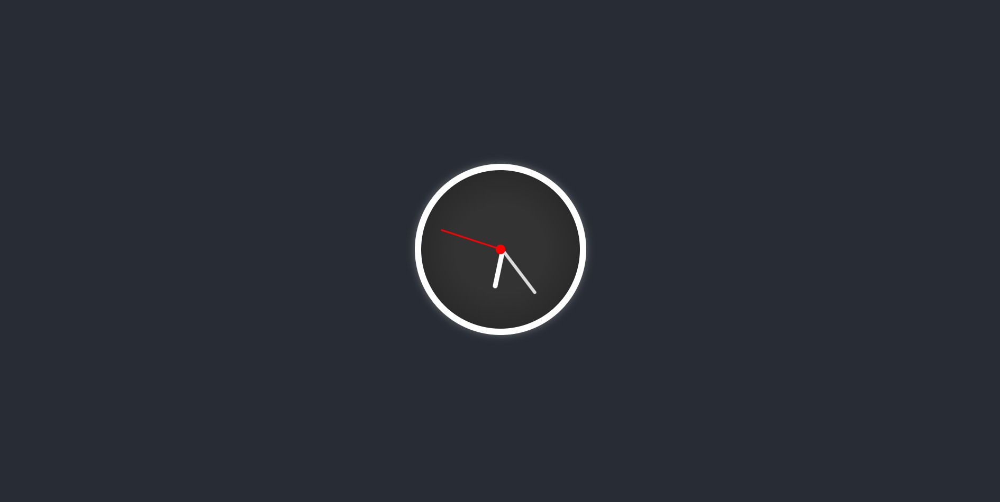
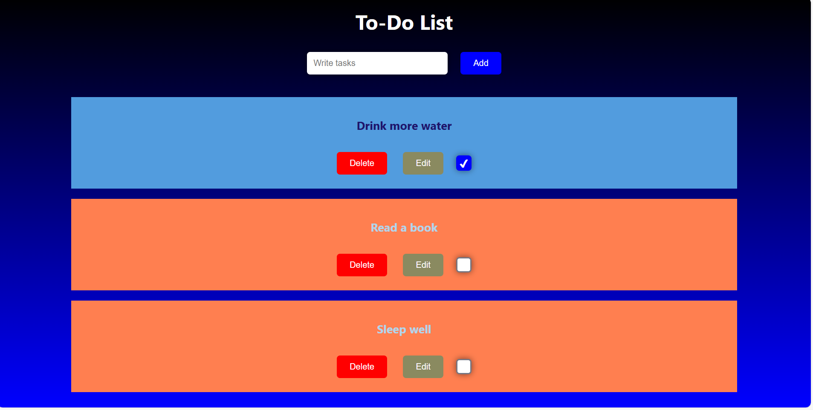
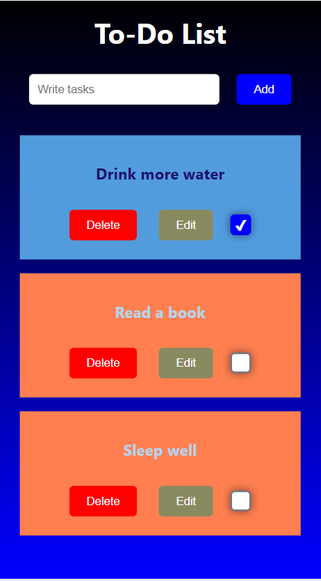

# Todo App 🚀

A simple and intuitive To-Do List application built with React. This project allows users to manage their tasks efficiently by adding, deleting, editing, and marking tasks as complete. Tasks are persisted in local storage, ensuring data is retained across sessions. The app also features an animated clock on initial load for a touch of visual appeal.

## 🚀 Key Features

- **Add Tasks:** Easily add new tasks to your to-do list.
- **Delete Tasks:** Remove tasks that are no longer needed.
- **Edit Tasks:** Modify existing tasks to keep them up-to-date.
- **Complete Tasks:** Mark tasks as complete to track your progress.
- **Local Storage Persistence:** Tasks are saved in your browser's local storage, so they persist even after you close the tab or browser.
- **Animated Clock:** Features an animated analog clock on initial load for a visually engaging experience.

## 🛠️ Tech Stack

- **Frontend:**
    - React
    - React DOM
- **Languages:**
    - JavaScript (ES6+)
    - HTML
    - CSS
- **Build Tools:**
    - React Scripts
- **Other:**
    - Local Storage (for data persistence)

## 📦 Getting Started

Follow these instructions to get the project up and running on your local machine.

### Prerequisites

- Node.js (version 12 or higher)
- npm or yarn

### Installation

1.  Clone the repository:

    ```bash
    git clone <repository-url>
    cd Todo-App
    ```

2.  Install the dependencies:

    ```bash
    npm install
    # or
    yarn install
    ```

### Running Locally

1.  Start the development server:

    ```bash
    npm start
    # or
    yarn start
    ```

2.  Open your browser and navigate to `http://localhost:3000` to view the application.

## 📂 Project Structure

```
Todo-App/
├── public/
│   ├── index.html          # Main HTML file
│   ├── favicon.ico         # Favicon
│   ├── manifest.json       # PWA manifest
│   └── ...
├── src/
│   ├── App.js              # Main App component
│   ├── App.css             # App styles
│   ├── index.js            # Entry point of the React application
│   ├── index.css           # Global styles
│   ├── components/
│   │   └── animatedClock.js  # Animated Clock component
│   │   └── index.css         # Clock styles
│   ├── reportWebVitals.js  # Web vitals reporting
│   └── ...
├── package.json          # Project metadata and dependencies
├── README.md             # Project documentation
└── ...
```

## 📸 Screenshots







## 🤝 Contributing

Contributions are welcome! If you'd like to contribute to this project, please follow these steps:

1.  Fork the repository.
2.  Create a new branch for your feature or bug fix.
3.  Make your changes and commit them with descriptive messages.
4.  Push your changes to your fork.
5.  Submit a pull request.

## 📬 Contact

Daveed Gangi - [daveedgangi@gmail.com](mailto:daveedgangi@gmail.com)

## 💖 Thanks Message

Thank you for checking out this To-Do App project! I hope it's helpful and easy to use. Your feedback and contributions are highly appreciated.

